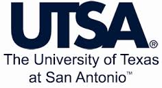

# Foyzul Hassan  
Ph.D. Student, Computer Science  
University of Texas at San Antonio  
Office: UTSA Main Campus, NPB 2.220  
 
<em>Curriculum Vitae: </em><a href="/files/Foyzul_Hassan_CV.pdf" target="_blank">PDF</a>  <small>(Oct, 2019)</small>  
<em>Email: </em><a href="mailto:foyzul.hassan@my.utsa.edu">foyzul.hassan@my.utsa.edu</a>  

  <em><a class="tosu">I will be joining <a href="https://umdearborn.edu/cecs/departments/computer-and-information-science" target="_blank">University of Michigan--Dearborn</a><a class="tosu"> in Fall 2020 as an  Assistant Professor in the Computer and Information Science! </a><em>

## About Me

I am a PhD candidate in <a class="tosu" href="http://www.cs.utsa.edu/" target="_blank">Computer Science</a> Department at <em><a class="tosu" href="http://www.utsa.edu/" target="_blank">UT San Antonio</a></em>, working under the supervision of <a href="http://www.cs.utsa.edu/~xwang/" target="_blank">Dr. Xiaoyin Wang</a>. My main interest is improving software development productivity. Some specific areas of interest to me are: continuous integration, software build process, script code analysis, program repair and fault localization, software engineering tools for machine learning (SE4ML), and security vulnaribility analysis for development tools.

Before joining PhD program, I worked in different roles of software engineering. I have 8+ years of industry experience in OOP, Software Quality Assurance, Test Automation, Release Management. I earned my bachelor's degree in Computer Science and Engineering from Military Institute of Science and Technology(MIST), Bangladesh. 

I'm privileged to work with prominent researchers from different sub-fields of computer science, including <a href="http://people.cs.vt.edu/nm8247/" target="_blank">Na Meng</a>, <a href="https://personal.utdallas.edu/~lxz144130/" target="_blank">Lingming Zhang</a>, <a href="https://www.microsoft.com/en-us/research/people/nachin/" target="_blank">Nachi Nagappan</a>, <a href="https://www.microsoft.com/en-us/research/people/tzimmer/" target="_blank">Tom Zimmermann</a>, and <a href="https://www.microsoft.com/en-us/research/people/hassanam/" target="_blank">Ahmed Hassan Awadallah</a>.

## Research Works

Find more about the work I've done on my  <a href="/research/" target="_blank">research page</a>.

<!-- 
 <em><a class="tosu"> Scroll down for news! </a></em>
 -->

## News

<table style="white-space: nowrap;">
	<tr>
	<td width="75"><b>Dec, 19'</b></td>
	<td>Our paper on Testing and Analysis of Behavioral Backward Incompatibilities is accepted in ICSE'20</td> 
	</tr>
	
	<tr>
	<td width="75"><b>Oct, 19'</b></td>
	<td>Received NSF travel grant to attend ASE'19 in San Diego, USA</td> 
	</tr>
	
	<tr>
	<td width="75"><b>Aug, 19'</b></td>
	<td>Awarded Outstanding Achievement in Research Award 2019 from UTSA Computer Science</td> 
	</tr>
	
    <tr>
	<td width="75"><b>Aug, 19'</b></td>
	<td>Doctoral Symposium paper on my Ph.D. research work got accepted in ASE'19</td> 
	</tr>
	
	<tr>
	<td width="75"><b>Feb, 19'</b></td>
	<td> I will work at Microsoft Research as a research intern this Summer</td> 
	</tr>
	
	<tr>
	<td width="75"><b>Jan, 19'</b></td>
	<td> Passed PhD Preliminary exam</td> 
	</tr>
	
	<tr>
	<td width="75"><b>July, 18'</b></td>
	<td> Our New Ideas Paper on Automating Updates of Dockerfiles is accepted in ASE'18</td> 
	</tr>
	
	<tr>
	<td width="75"><b>Apr, 18'</b></td>
	<td> Received NSF travel grant to attend ICSE'18 in Gothenburg, Sweden </td>
	</tr>

	<tr>
	<td width="75"><b>Dec, 17'</b></td>
	<td> Our paper on automatic fix of build configuration files is accepted in ICSE'18 </td>
	</tr>
	
	<tr>
	<td width="75"><b>Jun, 17'</b></td>
	<td>Our paper on software buildability is accepted in ESEM'17</td>
	</tr>

	<tr>
	<td width="75"><b>May, 17'</b></td>
	<td>Got Carlos Alvarez Graduate Fellowship</td>
	</tr>
	
	<tr>
	<td width="75"><b>Feb, 17'</b></td>
	<td>Our paper of Mining Readme File is accepted in ICSE'17 Poster Track </td>
	</tr>
	 
</table>
